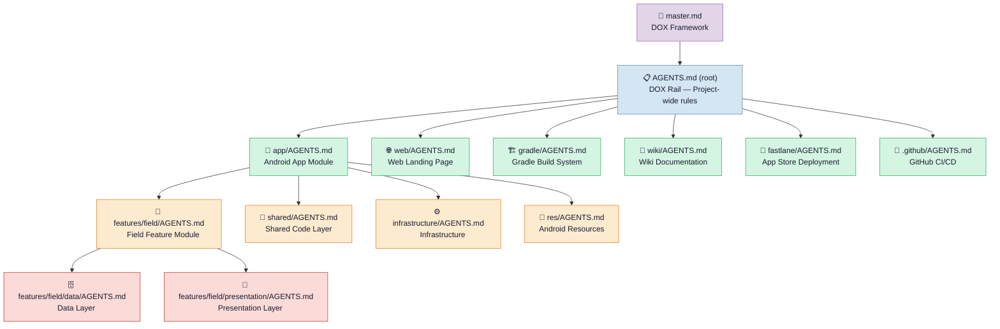

# DOX Hierarchy — AGENTS.md Tree

## Mermaid Diagram



## ASCII Tree

```
📐 master.md                          ← DOX Framework (the rules)
 └─📋 AGENTS.md (root)               ← DOX Rail (project-wide rules)
    ├─📱 app/AGENTS.md                ← Android App Module
    │  ├─🧩 features/field/AGENTS.md  ← Field Feature (core product)
    │  │  ├─🗄️ data/AGENTS.md        ← Data layer (weather, vision, AI, DB, etc.)
    │  │  └─🎨 presentation/AGENTS.md ← UI layer (screens, components, nav)
    │  ├─🔗 shared/AGENTS.md          ← Shared code (theme, icons, settings)
    │  ├─⚙️ infrastructure/AGENTS.md  ← Workers, widgets
    │  └─🎯 res/AGENTS.md             ← Android resources
    ├─🌐 web/AGENTS.md                ← Web landing page (Next.js)
    ├─🏗️ gradle/AGENTS.md             ← Build system (version catalog)
    ├─📖 wiki/AGENTS.md               ← Wiki documentation
    ├─🚀 fastlane/AGENTS.md           ← App store deployment
    └─🐙 .github/AGENTS.md            ← GitHub CI/CD, templates
```

## Legend

| Level | Role | Files |
|-------|------|-------|
| 📐 Framework | DOX rules | `master.md` |
| 📋 DOX Rail | Project-wide | `AGENTS.md` (root) |
| 📱 App Module | Android app | `app/AGENTS.md` + 5 children |
| 🌐 Web | Landing site | `web/AGENTS.md` |
| 🏗️ Build | Gradle | `gradle/AGENTS.md` |
| 📖 Docs | Wiki | `wiki/AGENTS.md` |
| 🚀 Deploy | Fastlane | `fastlane/AGENTS.md` |
| 🐙 CI/CD | GitHub | `.github/AGENTS.md` |

## Reading Order

When editing any file, read the DOX chain from top to bottom:

1. `master.md` — Understand the DOX framework itself
2. `AGENTS.md` (root) — Get project-wide rules (environment, workflow, Prompt.md)
3. Walk from root to target path, reading every AGENTS.md found along the route
4. Use the nearest AGENTS.md as the local contract for detailed guidance
