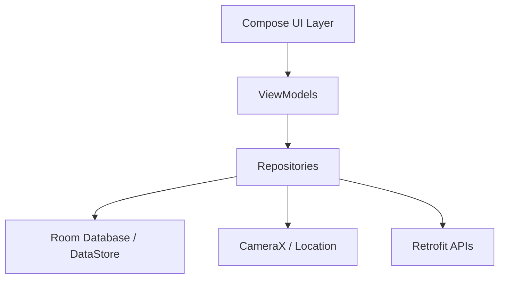

# FieldMind

**Observe. Question. Discover.**

FieldMind is an offline-first Android field research notebook built with Kotlin and Jetpack Compose. It helps researchers, naturalists, and citizen scientists capture observations, form hypotheses, track projects, analyze data, and generate reports — all without requiring an internet connection.

> ⚡ Originally forked from the Rhythm music player, FieldMind has been completely rebuilt into a dedicated field research platform.

---

## 🧭 Core Research Flow

```
Observe → Question → Research → Hypothesize → Collect Data → Analyze → Conclude → Archive
```

Every feature in FieldMind is designed to support this chain of scientific inquiry.

---

## 📱 Features

### 📸 Capture & Observe
- **Rich observation form** — subject, facts, category, confidence, tags, evidence, location, species identification
- **In-app camera** — capture photos directly within an observation session using CameraX
- **Location tagging** — automatic GPS capture with MapLibre offline maps
- **Species identification** — taxonomic browser with kingdom-to-species drill-down
- **Media attachments** — photos and evidence attached to observations

### 🔬 Research & Analysis
- **Research sessions** — timed sessions with background notifications, laps, and persistence
- **Research questions** — track questions with status, category, and linked hypotheses
- **Hypothesis management** — confidence scoring, status tracking, and evidence linkage
- **Data tools** — measurement log, checklist, counter, event log, site log, weather log, species tracker, comparison table
- **Reports** — generate structured reports from collected data
- **Flashcards** — spaced repetition (SM-2) for review and memorization

### 📚 Library & Learning
- **Knowledge library** — organize articles, papers, books, videos, websites, and notes
- **Sources** — curated reading with guided paper-reading prompts
- **Learn hub** — personalized learning path based on research activity
- **PDF viewer** — in-app document reading with annotations

### 📊 Insights & Dashboards
- **Home dashboard** — animated weather scene, current project, streak, stats, recent activity
- **Insights screen** — research health scores, category analysis, time-series analytics, knowledge graph visualization, weather correlation, achievements
- **Evidence hub** — filterable, sortable grid of all research records with bulk management
- **Field log** — chronological log with list/gallery views, advanced filters, session grouping

### 🗺️ Maps & Location
- **Offline maps** — powered by MapLibre, no API key required
- **Drawing tools** — points, lines, polygons on the map
- **Track recording** — GPS track logging
- **Geo-fence reminders** — location-based notifications

### 🔐 Privacy & Security
- **Biometric lock** — secure the app with fingerprint or face unlock
- **Offline-first** — all data stored locally in Room database
- **Encrypted backups** — export with passphrase protection
- **No analytics** — zero tracking code

### 🧠 AI Assistant (Optional)
- **Gemini integration** — observation review, question quality analysis, hypothesis suggestions, summarization, and flashcard generation without inventing evidence
- **Local model support** — bring your own LLM endpoint

### ⚙️ Settings
- **Profile** — researcher name, role, focus area, daily/weekly goals
- **Appearance** — Material 3 theming, light/dark mode, icon shapes
- **Capture defaults** — default category, certainty, evidence prompt, media planning
- **AI assistant** — Gemini API key, local model endpoint configuration
- **Backup & export** — encrypted ZIP backups, Markdown/CSV/JSON export
- **Security** — biometric lock, privacy settings
- **Data management** — cache clearing, database maintenance

---

## 🏗️ Architecture



### Tech Stack

| Layer | Technology |
|-------|-----------|
| Language | **Kotlin** 100% |
| UI | **Jetpack Compose** + **Material 3** |
| Architecture | **MVVM** with StateFlow |
| Database | **Room** (SQLite) — 9 entity types |
| Maps | **MapLibre** (offline, no API key) |
| Camera | **CameraX** (in-app capture) |
| Networking | **Retrofit** + **OkHttp** |
| Image loading | **Coil** |
| Background | **WorkManager**, **Foreground Service** |
| Widgets | **Glance** (Material 3) |
| Biometrics | **AndroidX Biometric** |
| Build | **Gradle Kotlin DSL**, version catalog |

### Data Model

- `Observation` — field observations with category, certainty, evidence, location
- `Note` — free-form research notes
- `Question` — research questions with status tracking
- `Hypothesis` — testable hypotheses with confidence scoring
- `Project` — research projects with methods, templates, journal
- `Source` — articles, papers, books, videos, websites
- `DataRecord` — structured data collection records
- `Report` — generated research reports
- `Flashcard` — spaced repetition review cards

---

## 🚀 Getting Started

### Prerequisites

- Android Studio Hedgehog (2023.1.1) or newer
- JDK 17
- Android SDK 34+

### Building

```bash
# Clone the repository
git clone https://github.com/firefly-sylestia/FieldMinds.git
cd FieldMinds

# Build F-Droid variant (FOSS)
./gradlew assembleFdroidDebug

# Build GitHub variant
./gradlew assembleGithubDebug
```

### Running

Open in Android Studio and run on a device or emulator targeting API 26+.

---

## 📁 Project Structure

```
app/
├── src/main/java/fieldmind/research/app/
│   ├── activities/           # Main activity, crash handler
│   ├── features/field/
│   │   ├── background/       # Timer service, notifications
│   │   ├── data/
│   │   │   ├── database/     # Room entities, DAOs, migrations
│   │   │   └── repository/   # Repository implementations
│   │   └── presentation/
│   │       ├── components/   # Reusable composables (weather, charts, camera, etc.)
│   │       ├── navigation/   # Navigation graph, screen definitions
│   │       └── screens/      # All screen composables
│   ├── shared/
│   │   └── presentation/     # Shared theme, icons, components
│   └── ...
├── docs/                     # Design documentation
├── wiki/                     # Legacy wiki (archive)
└── fastlane/                 # Play Store metadata
```

---

## 📦 Distribution

| Variant | Channel | Features |
|---------|---------|----------|
| `fdroid` | F-Droid | All features enabled |
| `github` | GitHub Releases | All features enabled |

---

## 📄 License

FieldMind is free and open source software.

---

## 🙏 Acknowledgments

- Originally forked from [Rhythm](https://github.com/cromaguy/Rhythm) music player
- Built with [Jetpack Compose](https://developer.android.com/jetpack/compose)
- Maps by [MapLibre](https://maplibre.org/)
- Icons by [Material Symbols](https://fonts.google.com/icons)

---

## 🔗 Links

- **GitHub**: [github.com/firefly-sylestia/FieldMinds](https://github.com/firefly-sylestia/FieldMinds)
- **Issues**: [github.com/firefly-sylestia/FieldMinds/issues](https://github.com/firefly-sylestia/FieldMinds/issues)
- **Translations**: [Crowdin](https://crowdin.com/project/fieldmind) *(coming soon)*
